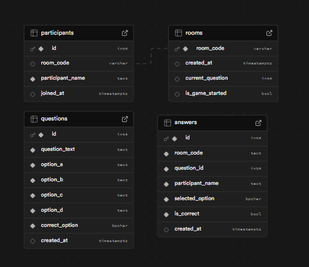
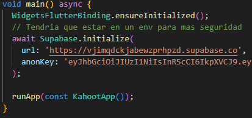
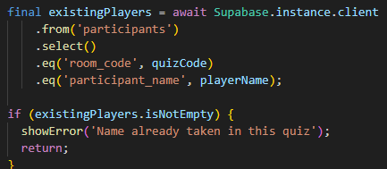
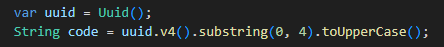
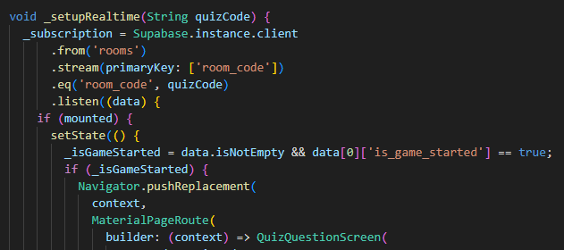

# kahoot_firebase Oscar Mur Entrega

# Proyecto 

# Archivos Entrega: 
    - /entrega
        - /main
        - apk
        - video

# Supabase (Database)

# Video example

📹 [Example video](https://monlaues-my.sharepoint.com/:v:/g/personal/oscarmurmat_campus_monlau_com/ESS8IA26ub1LoM7ip5Ka_BQBFOeV_6NeU5mTvF3FO7-YNg?nav=eyJyZWZlcnJhbEluZm8iOnsicmVmZXJyYWxBcHAiOiJPbmVEcml2ZUZvckJ1c2luZXNzIiwicmVmZXJyYWxBcHBQbGF0Zm9ybSI6IldlYiIsInJlZmVycmFsTW9kZSI6InZpZXciLCJyZWZlcnJhbFZpZXciOiJNeUZpbGVzTGlua0NvcHkifX0&e=vgOfoi)

# Code explication

How to initiate a supabase instance

How to subscribe onto a participant or room_code

How to create a random code

# Subscribe random code

